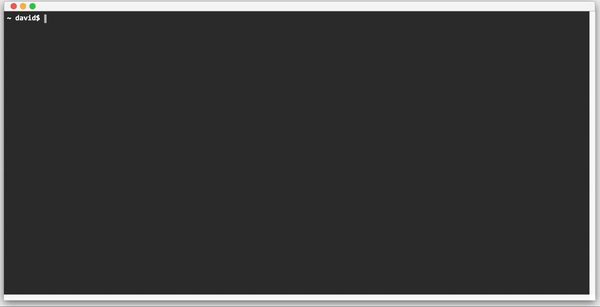

# css3-terminal

A terminal in CSS3 and SASS.

[Demo :point_right:](https://dellos7.github.io/css3-terminal/)



## Development

```shell
clone https://github.com/Dellos7/css3-terminal.git
cd css3-terminal
npm install
npm start
```

## TODOs

* Convert it into a web component
* Use of CSS variables
* Maybe use of Shadow DOM